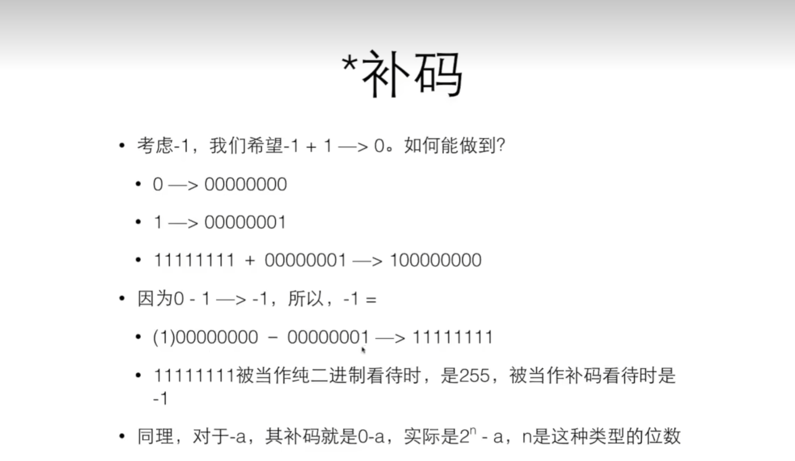
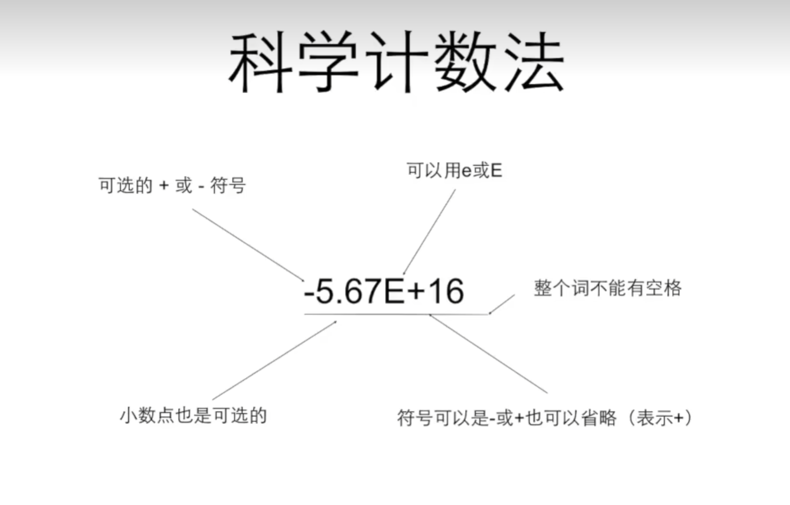
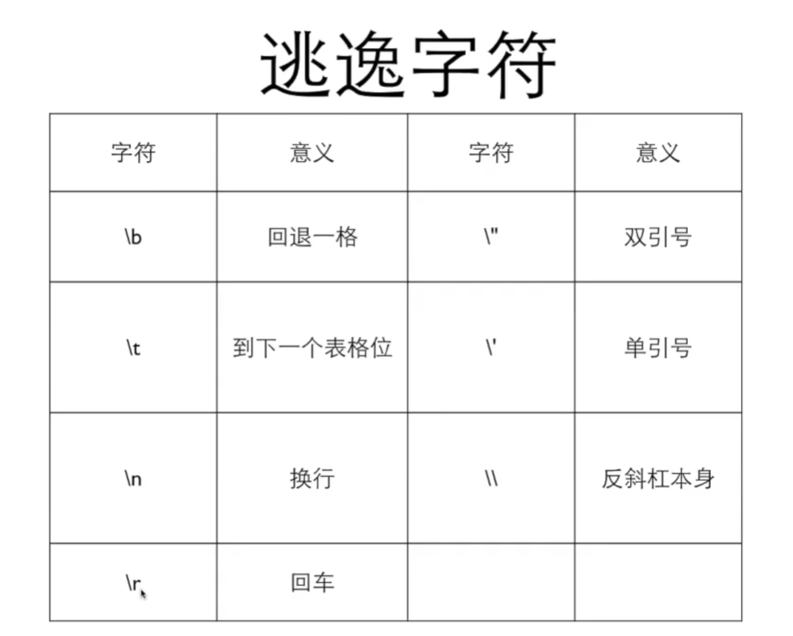

# 翁恺c语言


## 第一部分 基础语法 1~2
这是一个刷题的网站[洛谷](https://www.luogu.com.cn/)
<br>
这是一个简单的c语言程序,这个程序最后会输出5，然后空一行

```c
 #include <stdio.h>

int main(){
    int a=5;
    printf("%d\n",a);
    return 0;
}
```


 #include <stdio.h>     表示要用到这个stdio.h的库  
 int        表示一个类型定义（c是一种有类型的语言）  
 int a      表示我定义a是int类型变量  
 =      表示把右边的值赋予给左边（变量不赋值直接打印会得到垃圾值）  
 printf("要输出的正文",变量或者计算式);     打印   
 puts("")与printf("")功能基本相同，但是puts不可进行格式设定和数值输出，同时puts会自动输出换行符  
 printf输出一些字符需要用到逃逸字符如printf("%%")会输出%，而puts则不需要逃逸
 \n     是换行的特殊字符  
 return 0;      这个函数返回值为0  
 **在c语言中，换行（enter）往往不意味着什么事情，只是方便阅读而已**  
 变量定义一般形式：类型名称 变量名称  
 往往可以一次性定义多个变量，如 int a,b,c; 也是可以的  
 变量的名字只能由字母，数字和下划线组成，且数字不能在第一位  
 变量也不可以是c语言的关键字（保留字）：auto,break,case,char,const,continue等等  
 *在c99及之后，才允许在任何地方定义变量*  
 %d表示整数，%f表示浮点数，当然还有%ld和%lld这些  


scanf("%d",&a)      表示将读取的值输入到a对应的地址里，表观上来看就是将读到的值赋予给a   
&       是取址运算  


来一个有意思的东西：对于读入多个东西，如 scanf("%d %d",&a,&b) 只能读到（数字 数字），而 scanf("%d,%d",&a,&b) 只能读到（数字,数字）,那么继续推广就有，scanf("hello%d",&a) 只能读到（hello数字）  
继续我们有 scanf("%d %d\n",&a,&b) 在读到（数字 数字）后按下回车（enter），然后再随便输入一个什么东西（如a或者4）来满足那个\n（enter满足不了），scanf才运行完读取到a和b的值   


const int amount=100        表示amount是一个常量，const是一个修饰符，会让amount变成一个只读（read-only）的量，在做项目中，往往将amount大写  
const int AMOUNT=100        更加常见，易于知道AMOUNT是常量，100是直接量（literal）,这种莫名其妙出现的数字叫做魔术数字（magic number）  

c的整数和整数运算只会得到整数，如11/3会得到3，c中会直接舍弃掉小数点之后的东西  
有意思的是11/3*3会得到9而不是11  
而当浮点数和整数一起运算的时候，会自动将整数变成浮点数，然后进行浮点数的运算，结果也是浮点数  
float是单精度浮点数，double是双精度浮点数，整数输入输出都用%d，浮点数输入用%lf，输出用%f  

运算优先级 


total/=5+6        意思为total=total/(5+6),这种复合运算的优先级往往很低，+-*/%都是如此
++a或者--a表示为a递增或者递减后的值，a++或者a--仍表示a的值，递增和递减只能用于变量，不能用于数字

## 第二部分 基础函数 3~5
### if和else if
<br>

```c
 #include <stdio.h>
 
int main(){
    int a,b;
    scanf("%d %d",&a,&b);
    if(a>b){
        printf("a is bigger");
    }else if(a<b){
        printf("b is bigger");
    }else{
        printf("a is equal to b");
    }
    return 0;
}
```

这是一个用来判断a和b大小的程序if()这括号里面是布尔条件，如果非0，那么执行大括号里的程序，如果是0，则不跳过，else if是在前面按顺序if和else if均被判断跳过后，才执行判断，else是前面所有if和else均被判断跳过后，无须判断，直接执行else后面大括号的程序
<br>
if外面是不用加;的，但里面的程序需要

### 关系运算
| 运算符 | 意义 |
| --- | --- |
| == | 相等 |
| != | 不相等 |
| > | 大于 |
| >= | 大于或等于 |
| < | 小于 |
| <= | 小于或等于 |
 
 如果符合关系运算，那么会输出1，否则会输出0
 <br>
 所有的关系运算符运算优先级比算术运算的低，但是比赋值运算高，
 在关系运算中判断是否相等或者是否不相等的运算优先级是比其他关系运算要低的，同等优先级的关系运算是从左向右的

### switch与case

```c
 #include <stdio.h>
 
int main(){
    int type;
    switch (type)
        {
        case 1:
        case 2:
            printf("1or2\n");
            break;

        case 3:
            printf("3\n");

        case 4:
            printf("4\n");
            break;
        default:
            printf("null\n");
            break;
        }
    return 0;
}
```

switch语句可以看作是一种基于计算的跳转，计算控制表达式type的值后，程序会跳转到相匹配的case处,如果case都不符合，那么会执行default后面的语句，分支标号只是说明switch内部位置的路标，在执行完分支中的最后一条语句后，如果后面没有break，就会顺序执行到下面的case里去，直到遇到一个break，或者switch结束为止
<br>
type只能是整型或者整型的计算式

### while与do while

```c
while (x > 0) {
    n++;
    x /= 10;
}
```
while()里面是循环条件，和前面的if一样也是布尔条件，非0就循环while(){}大括号里面的语句，否则跳过
<br>
为了避免死循环，while大括号里面往往会存在改变小括号里面的东西
<br>

```c
do{
n++;
}while()
```
这个循环会先进行do{}大括号里面的语句，然后在根据是否满足while()小括号里的布尔条件进行判断是否循环

### for和break及continue

```c
for (i = 2; i < x; i++) {
    if (x % i == 0) {
        isPrime = 0;
        break;
    }
}
```
for是一个循环，这里其中i=2是初始条件，可以省略;i`<`x是循环条件，一样是布尔条件，不可省略;最后的i++是单次循环结束后会运行的语句，叫做步进，可以省略;即使起始条件和结束的语句都省略了，它们之间的分号不可省略
<br>
这里的break意思是打破所在的循环，即在for循环遇到break时，将直接运行for循环外后面的语句，但是break只能打破当前所在的循环，而不是被嵌套的所有循环
<br>
如果这个程序中的break是continue的话，那么意思是，这个循环后面的语句直接跳过，直接进行下一次循环，拿for循环举例顺序是：遇到continue——>跳过循环中continue后面的语句——>运行步进(如果有的话)——>继续判断是否要进行下一次循环
<br>

```c
#include <stdio.h>

int main() {
    int i = 0;
    while (1) {
        i++;
        if (i > 5) {
            goto end;
        }
        printf("%d\n", i);
    }

end:
    printf("结束\n");
    return 0;
}
```
其实打破循环还可以用goto，但是它会让程序变得很乱很难维护，goto的用法是，在任意一个地方写一个`goto 标号;`,然后在任意一个地方写`标号:`，那么运行`goto 标号;`时会直接跳转到`标号:`，实际上goto往往可被代替，所以一般不用

## 第三部分 类型 字符 逻辑运算 6

### 类型
c是一种有类型的语言，即每个变量要规定它的类型，表现为前面程序中的`int i`这种声明
<br>
c语言的类型一般分为四种:
<br>
整数:char,short,int,long,long long;还有逻辑，即bool也是整数类型
<br>
浮点数:float,double,long double
<br>
指针
<br>
自定义类型
<br>

```c
#include <stdio.h>

int main() {
    int a;
    a = 6;
    printf("sizeof(int)=%ld ", sizeof(int));
    printf("sizeof(a)=%ld", sizeof(a));
    return 0;
}
```

在这个程序中的sizeof是用来查看类型或者变量所占的字节数，最后这个程序会输出`4 4`，即int类型占据4个字节，同时1个字节占据8个比特，所以int类型占据32个比特
<br>
sizeof是静态运算符，结果在编译的时候就决定了，sizeof()小括号内的运算是不会进行的
<br>
当运算符两边出现了不同的类型，会自动转换成表达范围更大的类型
<br>
在数字的前面加上括号和类型，可以做到强制类型转换，如`(short)32768`,强制类型转换的优先级高于四则运算

#### 整数

|类型|占据字节数|
|---|---|
|bool|1|
|char|1|
|short|2|
|int|一般是4|
|long|一般是8|
|long long|8|

int一般表示的是一个寄存器的大小，同时也是cpu传递给ram一次数据的大小
<br>
在计算机中采用二进制保存数据，其中负数靠补码保存,拿char类型举例，如下图

那么我们知道0000 0000就是0，而高位为1的表示负数，高位为0的表示正数
<br>
如1111 1111\~1000 0000表示-1\~-128，如0000 0001\~0111 1111表示1\~127
<br>
1111 1111当作纯二进制时是255，当作补码时是-1

```c
#include <stdio.h>

int main()
{
    unsigned char c = 255;
    char i = 255;
    printf("c=%d, i=%d\n", c, i);
    return 0;
}
```

最后的输出结果是`c=255, i=-1`
<br>
当我们定义变量的时候加上unsinged，即无符号，变量就不会被当作补码看待，这样这个变量在正数表达的范围会扩大一倍，在平时的运算中我们需要注意整数是否越界，当遇到不可避免的越界时可以用高精度存储并运算
<br>
整数的输入输出只有int和long long,如果比int小，如char,short等都是用用int,如果比int大，就是用long long,具体如下  
%d：int  
%u：unsigned  
%ld：long long  
%lu：unsigned long long
<br>
如果一个字面数字是以0开头，那么就代表是8进制，如果是以0x开头，那么就是16进制，输入输出时%o用于8进制，%x用于16进制

#### 浮点数
| 类型 | 字长 | 范围 | 有效数字 |
| --- | --- | --- | --- |
| float | 32 | ±(1.20×10^-38~3.40×10^38), 0, ±inf, nan | 7 |
| double | 64 | ±(2.2×10^-308~1.79×10^308), 0, ±inf, nan | 15 |

inf即无穷大，nan即表示它不是一个有效的数字，而整型不会表达inf和nan，会直接报错
float的输入为%f，输出为%f，而double的输入为%lf，输出为%f，同时两者均可用%e输出，即用科学计数法
<br>
我们也可以用科学计数法来表达数

输出浮点数时，在``%`` ``f``之间加入.5,即可输出保留小数点后5位数字的浮点数，同理.16即可输出保留小数点后16位数字的浮点数，这个过程会进行四舍五入
<br>
给变量赋值浮点数时，如果浮点数的末尾没有f，那么这个变量会类型转换为double，如果加了f，那么就是float类型
<br>
直接比较浮点数大小可能失败，须用两个浮点数之差的绝对和小于一个很小的量来判断是否相等

### 字符
char不仅是一种整数类型，也是一种字符类型，用%c来做输入输出，想把数字当字符赋值给char变量时，须加上单引号，如`'1'`,在计算机内部存储字符用的是ASCII码，所以字符'1'不等于数字1
<br>
字母a到z在ASCII码表中的位置是相邻的，数字和大写字母也是如此



### 逻辑运算
用逻辑运算的时候，要添加这个头文件`#include <stdbool.h>`
<br>
然后我们可以写出`bool a=true;`的这种逻辑变量定义
<br>
但是实际上打印`true`仍然会显示`1`
| 运算符 | 描述 | 示例 | 结果 |
| --- | --- | --- | --- |
| ! | 逻辑非 | !a | 如果 a 是 true 结果就是 false, 如果 a 是 false 结果就是 true |
| && | 逻辑与 | a && b | 如果 a 和 b 都是 true, 结果就是 true; 否则就是 false |
| \|\| | 逻辑或 | a \|\| b | 如果 a 和 b 有一个是 true, 结果为 true; 两个都是 false, 结果为 false |

优先级如下
| 优先级 | 运算符 | 结合性 |
| --- | --- | --- |
| 1 | `() `| 从左到右 |
| 2 | `!` `+` `-` `++` `--` | 从右到左（单目的+和-） |
| 3 | `*` `/` `%` | 从左到右 |
| 4 | `+` `-` | 从左到右 |
| 5 | `<` `<=` `>` `>=` | 从左到右 |
| 6 | `==` `!=` | 从左到右 |
| 7 | `&&` | 从左到右 |
| 8 | `\|\|` | 从左到右 |
| 9 | `=` `+=` `-=` `*=` `/=` `%=` | 从右到左 |

有个非常有意思的东西，就是逻辑运算是自左向右运算的，如果左边的结果已经决定最终结果了，那么不会进行右边的运算，在逻辑或和逻辑与中非常常见
<br>
条件运算符：布尔条件？条件满足时候的值:条件不满足时候的值，如`max=a>b?a:b`,条件运算符的优先级比赋值高，但是低于其他运算符，条件运算符是自右向左结合的
<br>
逗号运算符:`,`用来连接两个表达式，并以其右边的表达式的值作为它的结果，其优先级是所有的运算符中最低的，结合关系是自左向右，所以左边的表达式会先计算，而右边的表达式的值就留下来作为`,`运算的结果

## 第四部分 函数和数组 7~8

### 函数

```c
#include <stdio.h>

int max(int a, int b)
{
    int ret;
    if (a > b) {
        ret = a;
    } else {
        ret = b;
    }
    return ret;
}

int main()
{
    int big=max(5,6);
    printf("%d",big)
}
```

这个程序中最后会输出6，其中的`max()`就是一个自定义的函数`int max(int a, int b)`叫做函数头，其中的`int`是返回类型，`max`是函数名，`int a,int b`是参数表，其余的是函数体，为主要计算的部分，其中的`return ret`就是这个函数的返回值，每次调用函数时要传入参数，如`max(5,6)`
<br>
函数仅调用值，不会影响外面变量的值，如传入参数a时，在函数中改变了a的值，而主函数a的值不会因此改变,函数只传值，函数里的变量是本地变量(局部变量)，生存期和作用域仅在这个函数内，块里定义了和块外同名的变量则会掩盖外面的变量，同时不能在一个块内定义同名的变量
<br>
一般来说，自定义函数写要在主函数前才能调用，但这样会让主函数更晚被阅读，所以我们可以先声明有这样的一个函数，即在主函数前写自定义函数的函数头，然后我们就可以先调用，在写自定义函数的函数体，如下

```c
#include <stdio.h>

int max(int a, int b);

int main()
{
    int big=max(5,6);
    printf("%d",big)
}

int max(int a, int b)
{
    int ret;
    if (a > b) {
        ret = a;
    } else {
        ret = b;
    }
    return ret;
}
```
### 数组


## 第五部分 地址与指针 9

## 第六部分 字符串 枚举 结构 10~11

## 第七部分 全局与局部 位运算 12~13

## 第八部分 可变数组 链表 14
