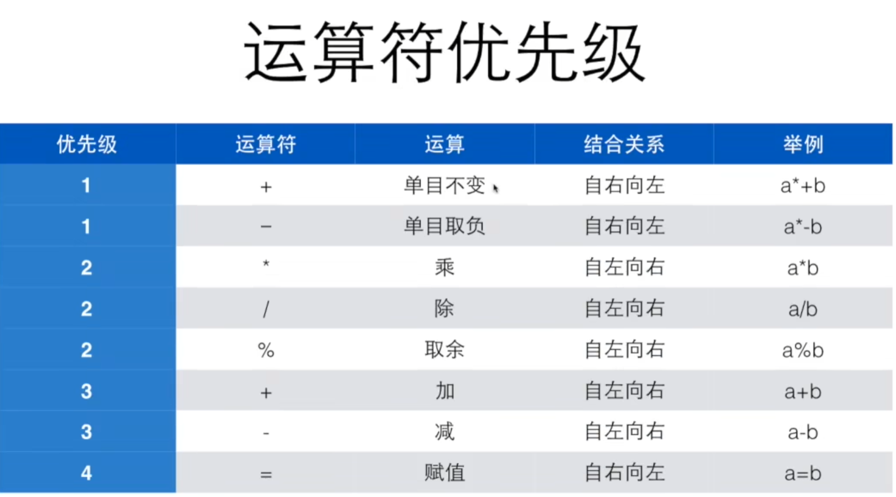

# 翁恺c语言


## 第一部分 基础语法 1~2
[洛谷](https://www.luogu.com.cn/)
<br>
这是一个简单的c语言程序,这个程序最后会输出5，然后空一行

```c
 #include <stdio.h>

int main(){
    int a=5;
    printf("%d\n",a);
    return 0;
}
```


 #include <stdio.h>     表示要用到这个stdio.h的库  
 int        表示一个类型定义（c是一种有类型的语言）  
 int a      表示我定义a是int类型变量  
 =      表示把右边的值赋予给左边（变量不赋值直接打印会得到垃圾值）  
 printf("要输出的正文",变量或者计算式);     打印  
 \n     是换行的特殊字符  
 return 0;      这个函数返回值为0  
 **在c语言中，换行（enter）往往不意味着什么事情，只是方便阅读而已**  
 变量定义一般形式：类型名称 变量名称  
 往往可以一次性定义多个变量，如 int a,b,c; 也是可以的  
 变量的名字只能由字母，数字和下划线组成，且数字不能在第一位  
 变量也不可以是c语言的关键字（保留字）：auto,break,case,char,const,continue等等  
 *在c99及之后，才允许在任何地方定义变量*  
 %d表示整数，%f表示浮点数，当然还有%ld和%lld这些  


scanf("%d",&a)      表示将读取的值输入到a对应的地址里，表观上来看就是将读到的值赋予给a   
&       是取址运算  


来一个有意思的东西：对于读入多个东西，如 scanf("%d %d",&a,&b) 只能读到（数字 数字），而 scanf("%d,%d",&a,&b) 只能读到（数字,数字）,那么继续推广就有，scanf("hello%d",&a) 只能读到（hello数字）  
继续我们有 scanf("%d %d\n",&a,&b) 在读到（数字 数字）后按下回车（enter），然后再随便输入一个什么东西（如a或者4）来满足那个\n（enter满足不了），scanf才运行完读取到a和b的值   


const int amount=100        表示amount是一个常量，const是一个修饰符，会让amount变成一个只读（read-only）的量，在做项目中，往往将amount大写  
const int AMOUNT=100        更加常见，易于知道AMOUNT是常量，100是直接量（literal）,这种莫名其妙出现的数字叫做魔术数字（magic number）  

c的整数和整数运算只会得到整数，如11/3会得到3，c中会直接舍弃掉小数点之后的东西  
有意思的是11/3*3会得到9而不是11  
而当浮点数和整数一起运算的时候，会自动将整数变成浮点数，然后进行浮点数的运算，结果也是浮点数  
float是单精度浮点数，double是双精度浮点数，整数输入输出都用%d，浮点数输入用%lf，输出用%f  

运算优先级 


total/=5+6        意思为total=total/(5+6),这种复合运算的优先级往往很低，+-*/%都是如此
++a或者--a表示为a递增或者递减后的值，a++或者a--仍表示a的值，递增和递减只能用于变量，不能用于数字

## 第二部分 基础函数 3~5
### if和else if
<br>

```c
 #include <stdio.h>
 
int main(){
    int a,b;
    scanf("%d %d",&a,&b);
    if(a>b){
        printf("a is bigger");
    }else if(a<b){
        printf("b is bigger");
    }else{
        printf("a is equal to b");
    }
    return 0;
}
```

这是一个用来判断a和b大小的程序if()这括号里面是布尔条件，如果非0，那么执行大括号里的程序，如果是0，则不跳过，else if是在前面按顺序if和else if均被判断跳过后，才执行判断，else是前面所有if和else均被判断跳过后，无须判断，直接执行else后面大括号的程序
<br>
if外面是不用加;的，但里面的程序需要

### 关系运算
| 运算符 | 意义 |
| --- | --- |
| == | 相等 |
| != | 不相等 |
| > | 大于 |
| >= | 大于或等于 |
| < | 小于 |
| <= | 小于或等于 |
 
 如果符合关系运算，那么会输出1，否则会输出0
 <br>
 所有的关系运算符运算优先级比算术运算的低，但是比赋值运算高，
 在关系运算中判断是否相等或者是否不相等的运算优先级是比其他关系运算要低的，同等优先级的关系运算是从左向右的

### switch与case
```c
 #include <stdio.h>
 
int main(){
    int type;
    switch (type)
        {
        case 1:
        case 2:
            printf("1or2\n");
            break;

        case 3:
            printf("3\n");

        case 4:
            printf("4\n");
            break;
        default:
            printf("null\n");
            break;
        }
    return 0;
}
```
switch语句可以看作是一种基于计算的跳转，计算控制表达式type的值后，程序会跳转到相匹配的case处,如果case都不符合，那么会执行default后面的语句，分支标号只是说明switch内部位置的路标，在执行完分支中的最后一条语句后，如果后面没有break，就会顺序执行到下面的case里去，直到遇到一个break，或者switch结束为止
<br>
type只能是整型或者整型的计算式

### while与do while

```c
while (x > 0) {
    n++;
    x /= 10;
}
```
while()里面是循环条件，和前面的if一样也是布尔条件，非0就循环while(){}大括号里面的语句，否则跳过
<br>
为了避免死循环，while大括号里面往往会存在改变小括号里面的东西


